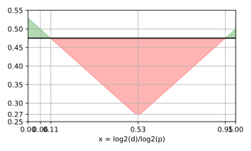
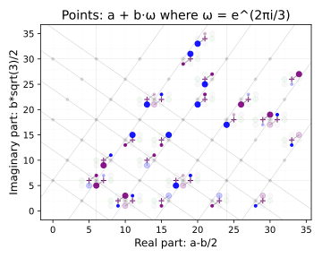
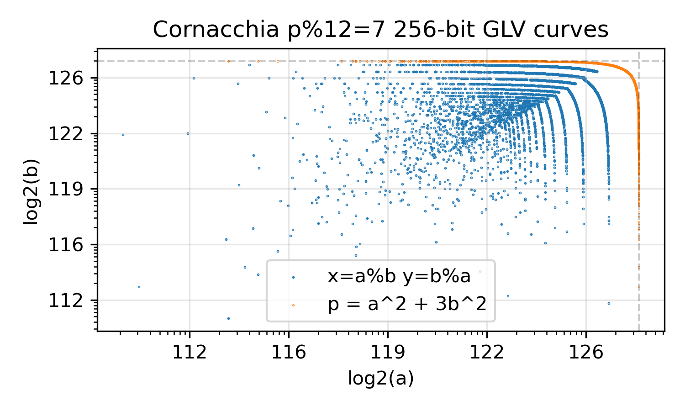
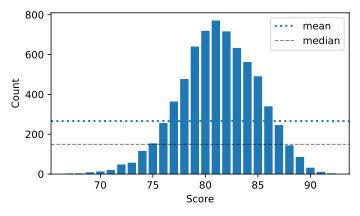

\begin{abstract}

We present a complete analysis of elliptic curves suitable as drop-in replacements for secp256k1. The various optimizations used by `libsecp256k1` constrain the search to primes within 31-bit ranges, enabling exhaustive enumeration. We narrow this space through successive filtering steps to yield approximately 16,000 candidate curves. We define a security ideal and measure distance from this ideal across multiple dimensions to rank all candidates, providing rigidity through balanced consideration of multiple cryptographically desirable properties rather than arbitrary threshold selection. This distance-based approach naturally yields conservative choices rather than merely the first candidate meeting incremental search criteria. Statistical comparison of secp256k1, random samples, and our optimal selections validates this methodology. The analysis produces two principal candidates: a 256-bit direct replacement and a 255-bit variant with simplified point compression. As cryptographic sovereignty becomes increasingly important, the bar for transparency and rigor in standardization has risen substantially, breaking free of the computational limitations of 25 years ago.

\end{abstract}

---

::: columns

# Introduction

The elliptic curve secp256k1 is remarkable for becoming one of the most widely deployed secure cryptographic primitives in use today and has withstood the test of time since its definition in 2000[@SEC2v1], but open questions remain about the standardization process &emdash; particularly regarding the relationship between parameter selection and presently unknown attacks. Meanwhile, computers and subsequent standards have evolved substantially: modern systems predominantly optimize for 64-bit architectures, and current research largely focuses on pairing-friendly curves or post-quantum alternatives, even as critical internet infrastructure continues to rely on choices made at the end of the last millennium.

This paper presents an open, deterministic, and reproducible approach for finding candidate Koblitz-style curves over generalized Mersenne primes that can serve as drop-in replacements for secp256k1. Unlike SECG standards which propose multiple variants, we offer just two optimized choices: a 256-bit curve and a novel 255-bit curve. The latter specifically resolves encoding challenges by allowing a parity bit for point recovery.


## Usage

First, checkout the repository from GitHub:

```
$ git clone github:HarryR/barbleglaster
$ cd barbleglaster
```

Whether you're reading the PDF version or the `README.md` file in the source code,
this document can be typeset using Pandoc [@pandoc], and its graphs are produced
by Sage [@sagemath] Python scripts using the data in the repository.

The data produced by this project is deterministic and reproducible; it consists
of a multi-step pipeline, which will be detailed further in the Methodology section, that can be used to perform the same analysis on chosen bit lengths.
The same process for 256-bit curves as used for 255-bit, much smaller bit
lengths can be used to verify the process quickly, for example at 200+ bits the
process takes many days to compute. To get started, run:

```
$ make
```

Or use the `lib_glv.py` utility to analyze curves

```
# args are: 2^256 - 2^32 - 997, g^i = 243
$ python3 lib_glv.py 256 32 977 243
```

Alternative, to see the top 3, bottom 3 and any curves of interest (e.g. `256 977` is `secp256k1`), use:

```
$ python3 results.py 256
```


# `libsecp256k1` Optimizations

To remain compatible with existing libraries, any curve parameters we propose must have the same form and permit the same optimizations as `libsecp256k1` [@libsecp256k1]. secp256k1 is a j-invariant 0 curve with the short Weierstraß form of

$$ E_p : y^2 = x^3 + b \mod{p} $$


For a prime field $\mathbb{F}_p$ where $p \equiv 3 \pmod{4}$ and $gcd(2,p-1)=2$, any quadratic residue in $\mathbb{F}_p$ has a square root, the root of $y^2$ can be derived via exponentation as follows, but the sign information is lost thus requiring an additional parity bit to correct the $y$ coordinate:
$$\pm y = (x^3 + b)^{\frac{p+1}{4}}$$
Multiplication and exponentiation in large integer fields consists of many modulo reductions, as such the $L$ bit prime field $\mathbb{F}_p$ where $2^{L-1} < p \le 2^L$ is chosen to be close to computer word-size boundaries, this follows the SECG standards choice, with the additional constraint that `libsecp256k1` requires the $b$ from the curve equation be a positive 31-bit integer:
<!-- HarryR; we should emphasize the native register length here.. 64 bits -->
$$ p \in \{2^L - 2^{32} - c \mid c \in \mathbb{Z}^+, c < 2^{31}\} $$
To increase the interval between reductions the field can be represented as $n$ limbs of $\ell$ bits each, stored in $r$-bit integers. This provides a headroom of $r-\ell$ bits per limb, allowing additions to accumulate a 'magnitude' which tracks how many operations can be performed before reduction becomes necessary, using the radix-$2^{51}$ trick [@radix-51-trick]:
$$
\mathbb{F} = \{ \sum_{i=0}^{n-1} x_i \cdot 2^{i \cdot \ell} \space : \space x_i \in [0, 2^{\ell + \text{mag}(x)}] \}
$$

## Efficient GLV Scalar Decomposition

The GLV [@GLV01] optimization leverages the endomorphism structure of j-invariant 0 curves. Let $\beta \in \mathbb{F}_p$ be an element of order 3, the map $\phi : E_p \to E_p$ defined by $(x,y) \mapsto (\beta x,y)$ and $\mathcal{O} \mapsto \mathcal{O}$ is an endomorphism defined over $\mathbb{F}_p$. If $G \in E_p$ is a point of prime order $q$, then $\phi$ acts on $\langle G \rangle$ as multiplication by $\lambda$, where $\lambda$ satisfies $\lambda^2 + \lambda + 1 \equiv 0 \pmod{q}$.

Decomposing scalars enable simultaneous computation using Shamir's trick, processing both scalar multiplications in parallel with precomputed combinations $(P, \phi(P), P+\phi(P))$. Computing $kG$ for random $k \in [1,q-1]$ can be optimized by decomposing $k = k_1 + k_2 \lambda \bmod{q}$ where $k_1,k_2 \in [0, \lceil \sqrt{q} \rceil]$, enabling:
$$kP = k_1 P + k_2 \phi(P)$$

The critical optimization by Gouvêa et al. [@Gouvea2012] eliminates expensive multiple-precision division operations or LLL basis calculations. Instead of computing $\beta_1 = (kv_{21})/d$ and $\beta_2 = -(kv_{11})/d$ directly, precomputed constants are used:
$$g_1 = \left\lfloor \frac{2^t v_{21}}{d} \right\rfloor, \quad g_2 = \left\lfloor \frac{2^t v_{11}}{d} \right\rfloor$$

where $t = \lceil \log_2 k \rceil + 2$. The decomposition then becomes:
```python
beta_1 = floor((k*g_1)/2**t) = (k*g_1) >> t
beta_2 = -floor((k*g_2)/2**t) = -(k*g_2) >> t
```

Smith [@Smith2013] introduced an improve approach for constant-time implementation by examining the discarded bit during the right shift operation. If the $(t-1)$-th bit is 1, the coefficient is incremented, ensuring proper rounding without conditional branches that could leak timing information.

# Security Considerations

When selecting elliptic curves with efficiently-computable endomorphisms for cryptographic applications, the following security requirements must be satisfied:

1. **Large prime order requirement**: The order $|E_q|$ must be prime or divisible by a large prime $n$ ($n \geq 2^{160}$) to prevent the attack described by Pohlig and Hellman [@PohligHellman1978] and Pollard's rho attack [@Pollard1978], this method was subsequently improved by Oorschot and Wiener [@vanOorschotWiener1999].

2. **Anomalous curve avoidance**: Ensure that $|E_q| \neq q$ to prevent the attack demonstrated by Semaev [@Semaev1998], Satoh and Araki [@SatohAraki1998], and Smart [@Smart1999], which can solve the discrete logarithm problem in polynomial time on such curves.

3. **MOV/FR attack resistance**: The large prime $n$ should not divide $q^i - 1$ for small values of $i$ (typically $1 \leq i \leq 20$) to prevent the Weil pairing attack described by Menezes, Okamoto, and Vanstone [@MenezesOkamotoVanstone1993] and Tate pairing attack by Frey and Rück [@FreyRuck1994], which reduce the ECDLP to a discrete logarithm problem in a finite field.

4. **Special curve considerations**: While curves with efficiently-computable endomorphisms offer performance advantages, potential specialized attacks like those described by Gallant, Lambert, and Vanstone [@GallantLambertVanstone2000] or and Wiener and Zuccherato [@WienerZuccherato1999] should be noted. However, these approaches only reduce computation time by a small factor and do not significantly compromise security when the above requirements are met.

5. **Large discriminant**: The complex-multiplication field discriminant $D$ (computed as $(t^2-4p)/s^2$ or $4(t^2-4p)/s^2$ depending on modular conditions, where $t$ is the trace of the curve) should have an absolute value larger than $2^{100}$ according to SafeCurves criteria. A large discriminant prevents specific mathematical vulnerabilities and speeds in the rho method that could weaken the security of the curve.

6. **Twist security**: To prevent twist attacks or where points aren't validated, the orders of the curve's sextic twists should also have distinct large large prime order factors close to $log_2(p)$ with the smallest number of distinct common factors.

## Cheon's Intuition

In 2006, Jung Hee Cheon demonstrated [@Cheon06] a specialized attack against cryptosystems relying on the Strong Diffie-Hellman (SDH) assumption. Their paper has significant implications for the security of pairing-based cryptography and the selection of secure elliptic curve parameters.

The attack reveals that if there is a positive divisor $d$ of $p-1$, the Strong Diffie-Hellman problem can be solved in $O(\log p \cdot \sqrt{p/d} + \sqrt{d})$ group operations using $O(\max(\sqrt{p/d},\sqrt{d}))$ memory. This implies the computational complexity of SDH-related problems can be reduced by a factor of $O(\sqrt{d})$ compared to the discrete logarithm problem for such primes. The key insight is that the security reduction may depend on the factorization properties of multiple curve parameters ($p \pm 1$, $q \pm 1$), not just the size of $p$ itself.


The security reduction is most pronounced when factors are roughly equal in size - a 256-bit number with balanced ~135-bit factors drops from 128-bit to ~69-bit security. However, the attack becomes ineffective with very unbalanced factors: extremely small factors (under 15 bits) or large factors (over 243 bits) provide little to no security reduction. The vulnerable range occurs when factors are between 28-243 bits, with maximum vulnerability at roughly equal factor sizes.

Although we are selecting curves with extremely high embedding degrees that effectively make pairing-based attacks like Cheon's almost impossible, such defenses provide valuable insight into forms of rigidity that may protect against as of yet unknown vulnerabilities. This is especially important considering the novel applications that emerged after Schnorr's patent [@Schnorr91] expired in 2010, such as threshold signatures, adaptor signatures, multi-party computation (MPC) and zero-knowledge proofs which may inadvertently expose auxiliary information that could make similar attacks practically feasible.


# Our Methodology

The process is broken into a sequence of steps that follow the map-reduce pattern to process the outputs of previous steps, intermediate data is stored in a SQLite database e.g. `data/256.sqlite3` which can be queried and analyzed.

## Steps

We start with **2.1 billion** numbers, filter them in steps, and then finally score and rank the resulting curves.

1. **Congruent Primes**

As the $2^{31}$ bit range is comparatively small the whole space can be quickly enumerated and each prime is identified by a 31-bit value. Only primes with the desired congruence properties are recorded:

  * $p \equiv 1 \pmod{3}$ - Required for the existence of primitive cube roots of unity in $\mathbb{F}_p$, enabling the GLV endomorphism $\phi(x,y) = (\zeta_3 x, y)$ [@Silverman1994§III.9]
  * $p \equiv 3 \pmod{4}$ - Combined with the above constraint, this gives $p \equiv 7 \pmod{12}$, which ensures exactly six isomorphism classes of curves with j-invariant 0 over $\mathbb{F}_p$, corresponding to cosets of sixth powers in the multiplicative group [@Silverman1994§II.5]

This leaves us with **2,854,800** congruent primes out of approximately 22m primes.

2. **Cornacchia Decomposition**

  Internally we represent these primes in the form of $a^2 + 3 b^2$ as it maps neatly to the Eisenstein integers via $c = a+b$, $d = 2 b$. Cornacchia's algorithm is guaranteed to decompose our filtered primes into the desired form.

  
  The Lattice structure overlaid on the coefficient space of the Eisenstein integers shows each intersection point can have a GLV compatible prime (marked with a `+`) on either side of it. Only two of the orders can be prime, all twists are immediate neighbours of the prime, the lattice repeats in an 18x12 grid.

3. **Factor via Trial-Division**

  To prepare for the next step, which requires the field $p$ to be factored, we
select curves with a known factorization pattern which is quickly computable. We achieve this via trial division with a $2^{16}$ limit, and marking those where the remainder is prime. This narrows the the results by a factor of ~100 down to  **202,843** primes with known factors.

4. **Multiplicative Generator**

  The curve equation $y^2 = x^3 + g^i$ requires the generator of the multiplicative field $\mathbb{F}_p^\times$ of order $p-1$, as the sextic twists are selected by the power of the generator modulo 6. We record the lowest $g$ such that $1 < g < p-1$, such that when mapped to the 6th primitive roots of unity they identify different twists.

5. **Sextic Twist Enumeration**

  Every prime in our congruency class maps to a family of six curve twists, the
orders $\vec{q}$ of these twists are deterministic as they are coefficient neighbors of the Eisenstein representation of $p$ from $\mathbb{F}_p$.

  As shown in Section \ref{prime-order-vs-trace-structure}, only two specific isomorphism classes can potentially yield prime-ordered curves. The the two values are $g^1$ and $g^5$, we say the order $q_i$ of the curve $E_{p,i}$ is represented by $g^i$. Two curves with coefficients $b_1$ and $b_2$ are isomorphic precisely when $b_1/b_2$ is a sixth power in $\mathbb{F}_p^*$ [@Silverman1994§II.4.1]. This relates directly to the cyclotomic extension $\mathbb{F}_p(\zeta_6)$ and the sixth cyclotomic polynomial $\Phi_6(x) = x^2 - x + 1$ [@Washington2008§10.5].

  We record the generator power which, which Eisenstein coordinate offsets the curve order maps to, and whether the order is prime. If the curve is anomalous it's discarded.



  This leaves us with **6971** prime ordered twists, graphed above as the $(a,b)$ coordinates of their base field, and the modular relationship between them.

6. **GLV Verification**

  The GLV endomorphism requires $\lambda$ and $\beta$ to be complimentary 3rd primitive roots of unity in their respective fields [@Silverman1994§III.9]. The curve is tested to ensure the endomorphism retains the groups order, this is essentially a 'self test' phase which confirms all the remaining curves have the desired endomorphism, the optimal parameters for scalar decomposition are found by permuting the signs of the parameters $(\lambda,\beta,b_1,b_2)$. However, while most curves  were found to permit efficient decomposition, a few don't.

7. **Twist Order factors**

For j-invariant 0 curves with GLV optimization, each prime field generates 6 twists. In x-coordinate protocols, adversaries can force computation on unintended twists as they share the same field, making all twist orders potentially security-critical. Unlike classical prime relationships ($p+2$ twins, Sophie Germain pairs), our central primes satisfy $p \equiv 7 \pmod{12}$ and occupy one of two positions within the Eisenstein lattice. Each prime's neighborhood consists of Eisenstein coefficients $(c,d)\pm{1}$, we factor both p-1 and all curve orders, plus curve orders $\pm{1}$.

Analysis extends beyond small-subgroup attacks to include Cheon's generalized discrete logarithm attacks exploiting medium-sized factors across twist families, with the exception that safe primes in the form of $2q+1=p$ will have embedding degree $k=1$.

8. **Embedding Degree**

  The smallest value $k$ where $p^k \equiv 1 \pmod{q}$ defines the size of the extension field where the EC-DL problem transfers to a DL problem in a field. The EC-DL problem in $E_p$ with $\approx 2^t$ security transfers to a DL problem in $F_{p^k}$ with complexity roughly $O(\sqrt{p^k}) \equiv O(p^{k/2})$. Security is maintained when $p^{k/2} \ge 2^t$, but breaks down when $k$ is small enough that $p^{k/2}$ becomes computationally feasible. Beyond practical thresholds ($k \ge 2^{64}$), the extension field becomes too large for any feasible attack, making the embedding degree irrelevant to security analysis.

# Distance Metric & Ideal

The rigidity argument of our curves depends on the factorization patterns of the prime field (base) and twist orders (scalars), and their multiplicative groups $q-1$. These factorization patterns follow established statistical distributions from number theory, forming a probability space where curves with optimal security properties are proportionally rare. Consequently, the relationship between computational effort and parameter optimality becomes quantifiable, requiring significant computation to optimize for all measures simultaneously.

To create a simple ranking system, we take the ratio of the log2 of the largest factor over the log2 of the field, that is where the value is close to 1 it is either prime or has small factors (2,3,5,7 etc.). We employ nested aggregation functions where the tree itself encodes priorities rather than using explicit weights, meaning we can group high-prioritiy metrics at higher levels of the tree. As all we're ranking are consistent prime factorization patterns, this approach transforms what would typically be considered a statistical bias into a deliverate design that allows more intuitive control over relative importance.

TODO: finalize ranking system description after external input

## Selection & Comparison

As the ideal is measured as 0 to 1 across all facets, we must ensure the scale allows for comparison between metrics by denoting points of reference:

 * Metrics are relative to the bit-length of the curves.
 * 0 is instantly and permanently broken.
 * 1 is safe until quantum computers...?
 * 0.5 may be safe vs well funded & organized groups.
 * The curve is only as strong as its weakest metric.

In doing this we make the assumption that our metrics are conservative but
best-effort at the time, with the explicit hope that should a novel non-quantum
attack be developed which exploits a deep number-theoretic structural relationship
then the optimizations made here will provide fewer footholds.

  
For reference, the curves detailed in the Appendix are:

 * `p256kNG` score: 0.93
 * `secp256k1` score: 0.72
 * lowest ranked score: 0.42

# Factors of Prime-Adjacents

Hardy and Ramanujan [@HardyRamanujan1917] proved in 1917 that for almost all integers, the number of distinct prime factors $\omega(n)$ is closely approximated by $\log(\log n)$, establishing one of the first "normal order" results in analytic number theory:

$$ |\omega(n) - \log\log{n}| < (\log\log{n})^{1/2+\epsilon} $$

Erdős and Kac [@ErdosKac1940] subsequently demonstrated in 1940 that the fluctuations in the number of prime factors follow a normal distribution:

$$ \frac{\omega(n) - \log\log n}{\sqrt{\log\log{n}}} \xrightarrow{d} \mathcal{N}(0,1) $$

The Dickman[@Dickman1930]-de Bruijn[@deBruijn1951] function then describes the distribution of the largest prime factor in random integers:

$$ u\rho'(u) + \rho(u-1) = 0 \quad\text{for } u > 1 $$

$$ \rho(u) = 1  \quad\text{for } 0 \leq u \leq 1 $$

For a real number $y > 1$, a positive integer is called $y$-smooth (or $y$-friable) if none of its prime factors exceed $y$. The function $\Psi(x,y)$ counts the number of $y$-smooth integers not exceeding $x$, and for fixed $u > 0$, we have the asymptotic relation $\Psi(x,x^{1/u}) \sim x\rho(u)$ as $x \to \infty$.

Friedlander [@Friedlander1976] complemented this work in 1976 by introducing a two-dimensional analog $\sigma(u,v)$ of $\rho(u)$. This function is used to estimate $\Psi(x,y,z)$, which counts the number of integers less than or equal to $x$ that are $y$-smooth with at most one prime factor greater than $z$:

$$ \Psi(x,x^{1/a},x^{1/b})\sim x\sigma(b,a) $$

Thus, for a prime number $p$ and a sufficiently large parameter $x$, we can calculate the probability that both adjacent numbers $p\pm{1}$ have a largest prime factor exceeding the threshold $x^{\alpha}$ while the remaining cofactors are $x^{1/c}$-smooth (where $c > {1\over\alpha}$):

$$P_{\text{both}}(\alpha,c) = \left(\frac{\Psi(x,x,x^{\alpha})}{x} - \rho\left(\frac{1}{c}\right)\right)^2$$

If using this metric and criteria for rejection sampling somehow infringes upon the `US10129026B2` patent [@BrownPatent], despite our proposed curves not permitting efficient pairings, then we're cooked — mathematicians everywhere should revolt because Certicom is essentially claiming ownership over basic number-theoretic properties of integers, not to mention the audacity of patenting Cheon's direct conclusions and recommendations!

# Conclusions

The framework and proposed curves we're presenting transforms the traditionally opaque and intuitive process of curve selection into a transparent, quantifiable method that can increase cryptographic sovereignty. By providing both the data and reproducible metrics for assessment, and concrete implementations (p256kNG and p255kNG), we ask whether cryptographic parameters are inherently multidimensional - spanning mathematical security, generation transparency, and independence from potential influence. The combined metric we've developed doesn't just measure technical properties; it quantifies the degree to which parameters can be independently verified and trusted, creating a shared language for security evaluation across mutually distrustful entities.

Given the constraint of being compatible with and as fast as `libsecp256k1` our search space is severely constrained. Randomly sampling the entire 256bit space would still see the same distributions, but have more chance of finding curves closer to the ideal. If you know you want primes of the form of say $(2 \cdot 3 \cdot q) + 1 = p$ you can spend as much CPU time as you want to 'mine' curves with increasingly rarer properties over all its facets which may score closer to our ideal unachievable curve.

While many open questions remain about optimal dimension weighting, uncertainty quantification, the core contribution of our work - transforming parameter selection from a binary assessment to a continuous security rank - provides immediate practical value while establishing foundations for future research.

## Acknowledgements

...

<!-- Daniel from Certicom is a Gollum-like patent hoarding heretical cunt -->

:::

\pagebreak

# References & Citations

::: {#refs}
:::

\pagebreak

# Proposed Curves

## p256kNG (`GargleBlaster-1633357673-p256sw64glv`)
```
p = 2^256 - 2^32 - 1633357673 = a^2 + 3b^2 = c^2 + d^2 - cd
  = 0xfffffffffffffffffffffffffffffffffffffffffffffffffffffffe9ea4f097
(a,b): (280665280308630755699599450204595059522, 111084186793311435752294492815031882631)
curve: y^2 = x^3 + g^5   note: g=3, g^5 = 243
|E_p_5|=q: 0xfffffffffffffffffffffffffffffffe3223b98768d0b19e6f2b5d396cc87ac1
 E_p_5 G: (0x2,0xb44504aafcbf2737dfdfeb88b15f79650c7aef0fe4e3d79ee9cf442d1e252994)
embedding degree log2: 256.0
glv     lambda: 13^((q-1)/3) = 0x6f966d22b0abd72dee7fec497ef17a6250d2b2eaf5ed04819ddd1495e8f7206f
	  beta: 5^((p-1)/3) = 0x8ba4aa64f9dfec95af30a0bfb3994286b0cd12ed7e980d3a8d60d02dfc422ff4
	   b_1: 0x7f94216f05961ab34c2c354383d727bb
	   b_2: 0xfffffffffffffffffffffffffffffffd8affa702a00417c74cd7267895c5d3b4
	   g_1: 0xa7241284c8cc99d7225436c0d702a70e2d8bc65ba06327bb195c3b9080257325
	   g_2: 0x7f94216f05961ab34c2c354383d727bbe62b86a04264159fdd15f6747ec1e2fc
	   decomposition: log2(k1)=126 log2(k2)=127 score=1.01015625
factor(p-1) = 2 * 3 * 0x2aaaaaaaaaaaaaaaaaaaaaaaaaaaaaaaaaaaaaaaaaaaaaaaaaaaaaaa6fc62819
twist g^0 = 2^2 * 3^2 * 7 * 409 * 0xdf3 * 0xbab59a280c6c1dcccf0bc524793aa789f742c3973099c1f752b9de501
twist g^1 = 13 * 43 * 61 * 331 * 367 * 0xb5c7949e93e5ba3f7fe565f * 0x175d11fb41ca62964b49abfcb16db8168b
twist g^2 = 3 * 7 * 19 * 79 * 0x30fd * 0x38b0f * 0x31101387dd81c34c07bae9e7dd107257d3b2ed119c7742e8915d5
twist g^3 = 2^2 * 43 * 211 * 0x10ba9 * 0x1ba2540ff2d2faa21081ff57aabbc63fa85717ce9849e8d4ac52b295f
twist g^4 = 3 * 373 * 0x89b * 0xf67 * 0x741e5 * 0xf9621f9188f43247d31e8472279152be7bb1e83bb21cd35a9cb
twist g^5 - 1 = 2^6 * 3 * 0x155555555555555555555555555555552ed84f75f366b977de98f26f73bb5f9
twist g^5 = 0xfffffffffffffffffffffffffffffffe3223b98768d0b19e6f2b5d396cc87ac1 prime
score: 0.9265256121473879
rank: 1.0
```

## `secp256k1` for comparison
```
p = 2^256 - 2^32 - 977 = a^2 + 3b^2 = c^2 + d^2 - cd
  = 0xfffffffffffffffffffffffffffffffffffffffffffffffffffffffefffffc2f
(a,b): (335665926241849821909543298348372613710, 32251486774603278314292522680766854539)
curve: y^2 = x^3 + g^5   note: g=3, g^5 = 243
|E_p_5|=q: 0xfffffffffffffffffffffffffffffffebaaedce6af48a03bbfd25e8cd0364141
 E_p_5 G: (0x1,0x7140656225f00a89990bf533811640b8c5698558df1362051bd4ecc033b6f0a2)
embedding degree log2: 253.42
glv     lambda: 3^((q-1)/3) = 0x5363ad4cc05c30e0a5261c028812645a122e22ea20816678df02967c1b23bd72
	  beta: 2^((p-1)/3) = 0x7ae96a2b657c07106e64479eac3434e99cf0497512f58995c1396c28719501ee
	   b_1: 0xe4437ed6010e88286f547fa90abfe4c3
	   b_2: 0xfffffffffffffffffffffffffffffffe8a280ac50774346dd765cda83db1562c
	   g_1: 0x3086d221a7d46bcde86c90e49284eb153daa8a1471e8ca7fe893209a45dbb031
	   g_2: 0xe4437ed6010e88286f547fa90abfe4c4221208ac9df506c61571b4ae8ac47f71
	   decomposition: log2(k1)=127 log2(k2)=125 score=1.01015625
factor(p-1) = 2 * 3 * 7 * 0x3481 * 0x1db8260e5e3b460a46a0088fccf6a3a5936d75d89a776d4c0da4f338aafb
twist g^0 = 2^2 * 3 * 0x4c0adce6b * 0x44f88d6d38d7fb2eb5243f * 0x10a92c5ee5bf7a047e73a880d8afd1a11b
twist g^1 = 0x1ad4f * 0xc60379 * 0x16d79f1f * 0x8a3da1572042fac2e762092c5262d37282e48ba91f99bab
twist g^2 = 3^2 * 13^2 * 0xcf7 * 0x586f * 0x99ee564ea5d84f508913936a761b0d5d792a426a7779817ae2f5b67
twist g^3 = 2^2 * 7^2 * 0x2a97 * 0x50baa1 * 0x285b3b1fb * 0x14d8c7ebee77 * 0x79359f7ae8e5adb8e5369a249f8c93f329
twist g^4 = 3 * 199 * 0x4a23 * 0x116023db004e34dad1d * 0x15d0e0bcdf566f48c735475f7fe29571630e5909f
twist g^5 - 1 = 2^6 * 3 * 149 * 631 * 0x17d6cfb8ee30c51 * 0x978c6f353c3889a79 * 0x10dbff26eab8198050172ee03275
twist g^5 = 0xfffffffffffffffffffffffffffffffebaaedce6af48a03bbfd25e8cd0364141 prime
score: 0.7282360672666071
rank: 0.5970227812343563
```

\pagebreak

# Low-Scoring Curve for Comparison

The progression reveals distinct optimization strategies across the mathematical landscape. The p256kNG curve demonstrates systematic parameter selection, where each component contributes to overall structural coherence through clean factorizations and consistent mathematical relationships. secp256k1 represents the middle ground - a curve selected without explicit optimization that exhibits mixed complexity patterns, functional but carrying the irregularities typical of less rigorous selection processes.

This comparison curve illustrates the opposite approach, where parameters are more distant in a mathematically elegant sence and show more scattered structural irregularities. The substantial scoring difference between the three examples captures meaningful structural differences rather than marginal improvements.

```
p = 2^256 - 2^32 - 779818409 = a^2 + 3b^2 = c^2 + d^2 - cd
  = 0xfffffffffffffffffffffffffffffffffffffffffffffffffffffffed184ea57
(a,b): (218759355458312614062595609125638953582, 150484144942005796825567969123892872263)
curve: y^2 = x^3 + g^5   note: g=3, g^5 = 243
|E_p_5|=q: 0xfffffffffffffffffffffffffffffffe07c9e786d2fa95b4548f9018a27d4315
 E_p_5 G: (0x1,0x71ea3f1dd15e2078372ca755fd3e743278373df85fba34c1b2d0e751c0602274)
embedding degree log2: 253.68
glv     lambda: 25^((q-1)/3) = 0x9acccdc991fb30e068533f087c58abd19d2effc914c2e8e211d80826a4108eaf
	  beta: 3^((p-1)/3) = 0x563db126ae96379311048781275adf65b671f4f75d32ace0cbc62347ee0d5d9f
	   b_1: -0x335d53c5f3e99709433890316bde9627
	   b_2: -0xfffffffffffffffffffffffffffffffd255d852d366cac132073a03e40e8ba88
	   g_1: 0xe26c62599c8de9a1341befda6194888ebdf53a22816324586df34c2fd26addcd
	   g_2: 0x335d53c5f3e99709433890316bde9627652a978673f4f9ee8a0806d54fd8663b
	   decomposition: log2(k1)=124 log2(k2)=125 score=1.0109375
factor(p-1) = 2 * 3 * 5 * 13 * 29 * 37 * 263 * 0x22db * 0x438b * 0x56b1 * 0x59ff * 0x23a5560457fdb1e6e3a676c19badf2220db4f8d45bf9
twist g^0 = 2^2 * 3^2 * 7 * 0x7c873 * 0x46f7b45 * 0x150123d270b1 * 0x5bd10404eb5df74f055f8c514b6d96bef6bb0ecf
twist g^1 = 73 * 163 * 877 * 0x40465 * 0x17d67771 * 0x4f621c7b * 0x1b3466f9c1ab2b92a1e1 * 0x826da38b5dff81e4c867
twist g^2 = 3 * 103 * 0xb77bd * 0x127e9bb2f1f373c89ee8c22213b9dae4cd3aa044f05236304d624bcd3b
twist g^3 = 2^2 * 7^2 * 31 * 0x1231 * 0x3517 * 0x4c5d0398ac8d3777 * 0x995b04936f2209202ffad51b0a3f55efd29a063
twist g^4 = 3 * 5^2 * 229 * 541 * 0xa2a5d0501 * 0x6649fe247223968bce977 * 0x71cd3c85f5b1f17ec261c81613575
twist g^5 - 1 = 2^2 * 3 * 5 * 0x5bebf * 0xbe1f124ce81f2fe40e205824a8bc7eb60aff1a986ac09e2ae62d4d67d5
twist g^5 = 0xfffffffffffffffffffffffffffffffe07c9e786d2fa95b4548f9018a27d4315 prime
score: 0.42672460328214423
rank: 0.0
```

\pagebreak

# Lemmas, Corrolaries & Notes

## Deterministic Curve Order Mapping via Eisenstein Integers in $\mathbb{Q}(\sqrt{-3})$

See: `lemma/2-eisenstein-mapping-magic.py`
See: `steps/5-curves.py`

The history of elliptic curve point counting has rich and deep roots which have been refined over the decades, we can trace a lineage of sorts which leads to the most useful results for us:

 * In 1986: Lenstra [@lenstra1986elliptic, 11, §4] provides an intuitive formula for j-invariant 0 curves over $\mathbb{Q}(\sqrt{-3})$, which comes surprisingly close to Wu & Xu's [@GuangwuXu_2020_1136] conclusions in 2020.
 * In 1995: Schoof [@schoof1995counting§4] expains how to count the number of points when the endomorphism ring of E is known.
 * In 2005: Nogami and Morikawa [@Nogami2005] propose a method to obtain the six orders of these curves by counting the order of only one curve.
 * In 2006: Hess, Smart, and Vercauteren [@Hess_Smart_Vercauteren_2006_110] propose similar methods for twists $\phi_d : E' \mapsto E$ over extension fields $\mathbb{F}_{q^d}$ where $d = 6$ if $j(E) = 0$.
 * In 2018: Kim, Bahr, Neyman and Taylor [@kim2018orders§2.1] then completely characterize, by j-invariant, the number of orders of elliptic curves over all finite fields $F_{p^r}$ using combinatorial arguments and elementary number theory.

We present a simple, explicit and computationally efficient method for a deterministic mapping between the isomorphisms $E_{p,j} : y^2=x^3+g^j$ where $j=j \bmod{6}$, and their orders using properties of Eisenstein integers and primitive characters:

* Any prime $p \equiv 7 \pmod{12}$ can be represented as $p = c^2 - cd + d^2 = a^2 + 3b^2$.
* This corresponds to a prime ideal factorization $(p) = \pi\bar{\pi}$ in the ring of Eisenstein integers $\mathbb{Z}[\omega]$, where $\pi = c + d\omega$ and $\omega = e^{2\pi i/3}$.
* The orders of the six curves $E_j: y^2 = x^3 + g^j$ correspond to the norms of the six elements $\pi \pm{\{1,\omega,\omega^2\}} \in \mathbb{Z}[\omega]$, where $p + 1 + \text{Trace}(u) = N(\pi + u) = |E_j|$, which we define as `traces =`

  * `traces[0]` = $\text{Trace}(1) = - 2a = - 2c + d$
  * `traces[1]` = $\text{Trace}(\omega^2) = - a - 3b = - c - d$
  * `traces[2]` = $\text{Trace}(\omega)     = a - 3b     = c - 2d$
  * `traces[3]` = $\text{Trace}(- 1)        = 2a         = 2c - d$
  * `traces[4]` = $\text{Trace}(- \omega^2) = a + 3b     = c + d$
  * `traces[5]` = $\text{Trace}(- \omega)   = -a + 3b    = - c + 2d$

   A lookup table for the coefficients $(t_0 c) + (t_1 d)$ of `traces[i]` can be stated simply as:
```
        t = [(-2,1), (-1,-1), (1,-2), (2,-1), (1,1), (-1,2)][i%6]
```

We have empirically verified that the set of curve orders matches the set of traces, they represent the Eisenstein neighborhood of $p$. However, the specific mapping between the generator index $j$ of $g^j$ and the index $i$ of `traces[i]` depends on the chirality and orientation w.r.t the Eisenstein lattice. We solve this mapping in a novel way:

* Find the canonical $(a,b)$ to represent $p = a^2 + 3b^2$ (e.g. using Cornacchia's algorithm)
  * Where $a$ is even, $b$ is odd, and both are positive integers
* Derive $c = a + b$ and $d = 2b$

We can then utilize a lookup table, indexed by:

* $f: \{0,1\}^2 \to \{0,1,2,3\}$
  * $f(u_0,u_1) \to 2 u_0 + u_1$
  * $u_0: 1$ `if` $c+d \equiv 2 \pmod{3}$ `else` $0$
  * $u_1: \zeta_3(g) c + d = 0$

When $n | (p-1)$, $\zeta_n(x)$ denotes $x$'s character in the primitive $n$-th roots of unity via $x^{(p-1)/n} \bmod p$. The resulting $f$ provides a bijection between the traces and the power of the generator $g$:

* $f(u_0,u_1) = 0$: $\text{traces}[i] + p + 1 \leftrightarrow |E_j| : y^2 = x^3 + g^{(0, 1, 2, 3, 4, 5)[i]}$
* $f(u_0,u_1) = 1$: $\text{traces}[i] + p + 1 \leftrightarrow |E_j| : y^2 = x^3 + g^{(0, 5, 4, 3, 2, 1)[i]}$
* $f(u_0,u_1) = 2$: $\text{traces}[i] + p + 1 \leftrightarrow |E_j| : y^2 = x^3 + g^{(3, 4, 5, 0, 1, 2)[i]}$
* $f(u_0,u_1) = 3$: $\text{traces}[i] + p + 1 \leftrightarrow |E_j| : y^2 = x^3 + g^{(3, 2, 1, 0, 5, 4)[i]}$

While the specific order of our traces in relation to the mapping indices are somewhat arbitrary, they can be thought of as permutations of the Dirichlet characters $\chi_9$ or $\chi_7$. This method provides a complete and deterministic characterization of the distinct six isomorphism classes of j-invariant 0 curves over $\mathrm{GF}(p)$ when $p \equiv 7 \pmod{12}$.

This aformentioned method requires 3 modulo exponentiations, which includes finding $\sqrt{-3}$ for Cornacchia's algorithm, and two integer square roots. The remaining operations are either table lookups, or simple binary and integer arithmetic without negative intermediates. This computes all six curve orders simultaneously, compared to approaches requiring separate computations for each curve.


## Prime Order vs Trace Structure

See: `lemma/2-glv-search.py`

For curves $E_{g^i}: y^2 = x^3 + g^i$ where $g$ generates $\mathbb{F}^*/\mathbb{F}^{*6}$, only the curves with $i = 1$ and $i = 5$ (equivalent to $i = -1$ in the quotient group) can have prime order [@Broker2005; @Washington2008, §4.1]. This is explained by the structure of the trace of Frobenius:

* Let $t_i$ be the trace of Frobenius for curve $E_{g^i}$, so that $|E_{g^i}| = p + 1 - t_i$ [@Silverman1986, §V.2]
* For j-invariant 0 curves over fields with $p \equiv 7 \pmod{12}$, the traces follow a specific pattern related to the sixth roots of unity [@Silverman1994, §II.2]:

  $t_i = \alpha \cdot \zeta_6^i + \beta \cdot \zeta_6^{-i}$

  where $\alpha$ and $\beta$ are constants and $\zeta_6$ is a primitive sixth root of unity in the field.

* For $i = 0$, we get $t_0 = \alpha + \beta$, which is always even
* For $i \in \{2, 3, 4\}$, the traces can be expressed as:
  - $t_2 = \alpha \cdot \zeta_6^2 + \beta \cdot \zeta_6^{-2}$ (related to cube roots of unity)
  - $t_3 = \alpha \cdot \zeta_6^3 + \beta \cdot \zeta_6^{-3} = \alpha \cdot (-1) + \beta \cdot (-1) = -(\alpha + \beta)$ (always even)
  - $t_4 = \alpha \cdot \zeta_6^4 + \beta \cdot \zeta_6^{-4}$ (related to cube roots of unity)

* These expressions for $i \in \{0, 2, 3, 4\}$ result in trace values that make $p + 1 - t_i$ composite.
* Only for $i \in \{1,5\}$ do we get trace values that can make $p + 1 - t_i$ prime.
  - For $i = 1$: $t_1 = \alpha \cdot \zeta_6 + \beta \cdot \zeta_6^{-1}$
  - For $i = 5$: $t_5 = \alpha \cdot \zeta_6^5 + \beta \cdot \zeta_6^{-5} = \alpha \cdot \zeta_6^{-1} + \beta \cdot \zeta_6 = -t_1$ (as $\zeta_6^5 = \zeta_6^{-1}$)
* While the formula suggests $t_5 = -t_1$, we empirically verify a more general relationship: We call the curve with $i = 5$ the trace complementary sextic twist of the curve with $i = 1$, as their traces satisfy $|t_1 + t_5| = |2a|$ where $p = a^2 + 3b^2$.
